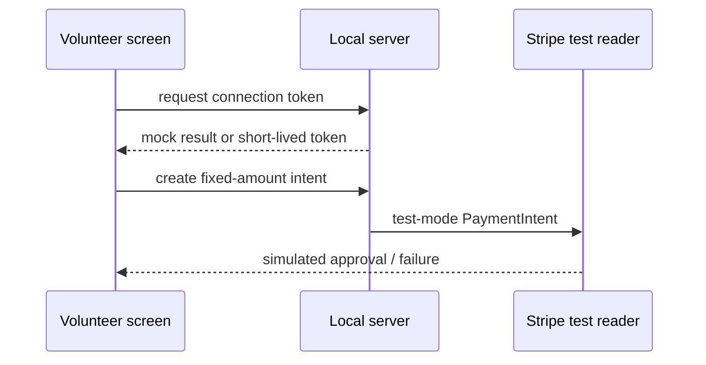

# Tap-to-Donate Terminal

[](https://github.com/mjumair7/tap-to-donate-terminal/actions/workflows/ci.yml)

A small event-terminal prototype I built to explore the boundary between a simple volunteer-facing screen and Stripe Terminal's server-side payment flow.

The repository defaults to a local mock. It can also connect to Stripe's simulated reader with a test-mode key. The server deliberately rejects live Stripe keys, so this project cannot accidentally become a real donation terminal just because somebody pasted the wrong credential.



## Run in mock mode

```sh
npm start
```

Open <http://127.0.0.1:8787>. Choose a fixed amount and press **Simulate terminal tap**. No card data is requested and no payment is created. The screen labels the result as a mock.

## Run with Stripe's simulated reader

```sh
export STRIPE_SECRET_KEY=sk_test_...
npm start
```

The browser loads Stripe Terminal.js, requests a short-lived connection token from the local server, connects to a simulated reader, and processes a test-mode `card_present` PaymentIntent.

Only keys beginning with `sk_test_` are accepted. The secret stays on the server and is never sent to browser code.

## Test

```sh
npm test
```

The tests cover allowed donation amounts, malformed inputs, explicit mock behavior, and rejection of live or malformed Stripe keys.

## Boundaries

This prototype:

- accepts only the configured $5, $10, and $20 amounts;
- listens on localhost by default;
- does not collect donor identity;
- does not issue tax receipts;
- does not store payment records;
- does not claim that a mock result is a completed donation.

A real event deployment would need HTTPS, a registered physical reader and location, idempotency handling, receipt workflows, operational monitoring, accessibility testing, and an organization's own security and finance review.

For a WisePOS E or another physical reader, the simulated discovery call would also have to be replaced with the correct location-based reader flow. That work is intentionally outside this repository.

MIT licensed.
